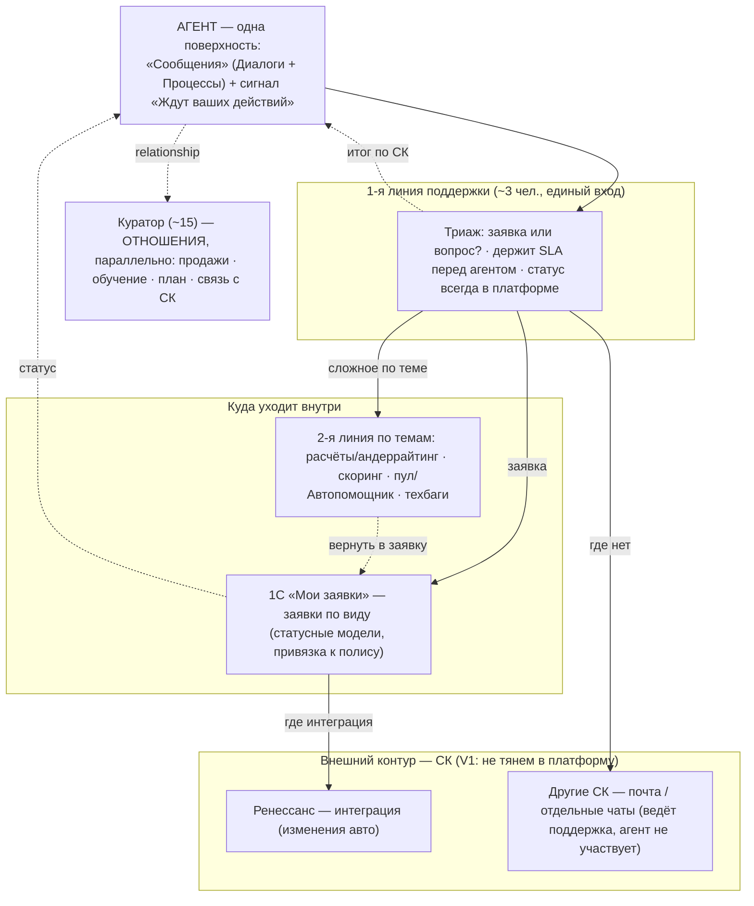
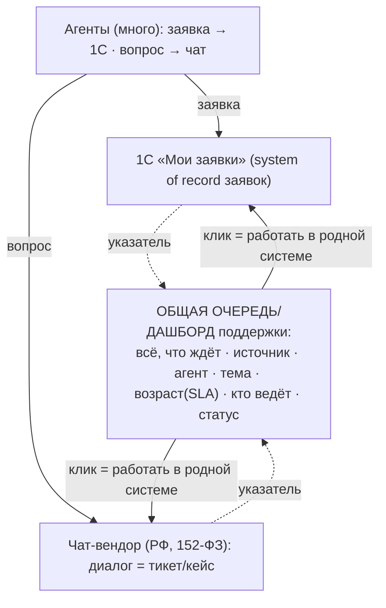

# Архитектура поддержки (to-be)

Снимок решений на 2026-07-20. Собрано в разговоре с владельцем (формулировка → ревью → to-be).
Это **бизнес/сервисная** архитектура: кто помогает агенту, через что, как эскалирует.
Агентскую **витрину** (единый ящик «Сообщения»: Диалоги + Процессы) делает параллельная сессия —
см. STATUS.md. Здесь — то, что **за** витриной.

Смежные документы: [MESSAGING.md](./MESSAGING.md) (выбор чат-бэкенда), [knowledge/10-processes.md](./knowledge/10-processes.md) (статусные модели заявок), [knowledge/01-system-overview.md](./knowledge/01-system-overview.md) (роли).

---

## 1. «Поддержка» — это три разные вещи

Их постоянно смешивают, а это физически разные системы.

| # | Что | Где живёт | Суть |
|---|-----|-----------|------|
| 1 | **Заявки** (изменение / расторжение / убыток) | **1С**, раздел «Мои заявки» | Тикет-система, привязана к договору; статусные модели по виду `[10-processes.md]` |
| 2 | **Общий чат** | Отдельный **РФ-вендор** (не выбран) | Живой чат общих вопросов; наш Angular-UI, не виджет |
| 3 | **Куратор** | В том же чате + свой дашборд (потом) | Отношения: продажи, обучение, план, связь агент↔СК |

---

## 2. Роли и решения владельца (зафиксировано 2026-07-20)

- **Поддержка — ОДНА команда (~3 чел.)**: ведёт и заявки (1С), и общий чат. Операционно единый вход.
- **Граница поддержка ↔ куратор — «функция vs отношения»**: поддержка = операционка/техника (котировка не идёт, оплата, полис, заявки); куратор = продажи, обучение, план, отношения. Куратор — **параллельный канал, не ступень эскалации**.
- **Эскалация 1-й линии:**
  - **внутрь — 2-я линия ПО ТЕМАМ** (структурирована): расчёты/андеррайтинг · сегментация/скоринг · пул/Автопомощник · техбаги. Заявка/вопрос уходит по типу к нужному специалисту.
  - **наружу — в СК** почтой / отдельными чатами (Ренессанс — исключение: изменения идут интеграцией).
- **СК — ВНЕШНИЙ контур (V1):** общение с СК остаётся у поддержки, в платформу не тянем.
- **Заявки ОСТАЮТСЯ в 1С** (домен, ПДн, привязка к полису) — подтверждено. Значит общую очередь строим **сами**.
- **Агент видит по СК-части ТОЛЬКО ИТОГ** («принято» → «готово/отказ»); промежуток скрыт. Но **поддержка видит всю кухню** в своём кокпите (иначе своя же команда не увидит, где застряло).
- **Сообщения = тикеты/кейсы** (назначение, SLA, «кто ведёт», отчёты).
- **Агентский чат-UI — НАШ Angular** (виджет Chatwoot отклонён — «чужой»); граница `ChatService` изолирует чат.
- Жёстко: **152-ФЗ** (данные в РФ). Будущее: канал **МАКС**, звонки.

---

## 3. Схема to-be



**Два принципа:**
1. **Витрина одна, кухня скрыта.** Агент не выбирает «поддержка/куратор/2-я линия» — это наша маршрутизация.
2. **Статус всегда в платформе, даже когда работа снаружи.** Вот что отличает нас от «по почте в никуда»: поддержка ведёт статус в системе, даже переписываясь с СК почтой. (Агенту — итог; поддержке — весь трек.)

---

## 4. Кокпит поддержки — «тонкая агрегация» (наш дашборд)

Одна команда работает в двух системах (1С + чат-вендор) → нет общей очереди. Лечим тем же приёмом,
что и агенту: **объединить обнаружение, развести действие**. НЕ сливаем 1С-заявки в чат-вендор
(ПДн + доменные статусы + вендор-лок на ядро; та же причина, по которой не зеркалим на стороне агента).



**Модель элемента очереди** (указатель, не копия данных):
```
QueueItem { source: '1c' | 'chat', agent, topic, ageMinutes /*SLA*/, assignee, status, deepLink }
```

**Два шага:**
- **Шаг 1 (дёшево):** дашборд ЧИТАЕТ открытые заявки из 1С (поля уже есть в `[ФТ-5]`) + открытые диалоги из API вендора → мержит в один список; клик открывает родную систему. Read-only, ПДн не дублируем.
- **Шаг 2 (позже):** действия в дашборде (назначить/сменить статус/ответить) — когда очередь докажет ценность.

**Отвергнуто:** (B) хелпдеск-вендор как хаб с заявками внутри — дублирует ПДн в вендора, плющит доменные статусы, вендор-лок на ядро. (C) два кокпита — сегодняшняя фрагментация.

---

## 5. Выбор чат/ops-вендора

**Ключевая логика:** раз заявки остаются в 1С, **очередь строим сами в любом случае** → ops-сила вендора
перестаёт быть решающей → вендор выбирается по **чат-оси: сможем ли построить СВОЙ UI над его бэкендом**
(killer-критерий; на нём умер Chatwoot; виджет в кабинет не возвращаем).

**№1 на спайк — Webim.**
- **Realtime API 2.0** — «для взаимодействия с чат-сервером из внешних систем». И это доказано их
  собственными **Mobile SDK** (нативные кастомные UI на том же visitor-API) → путь «наш UI, их бэкенд»
  first-class и продакшн-проверен, а не «наверное, через API».
- **On-prem / облако РФ** — самый жёсткий 152-ФЗ. МАКС — через Custom Channel API (есть, не нативно). Ops (очередь/отчёты) — продаётся банкам.

**План Б — HelpDeskEddy.** РФ + госрегистрация ПО (№2022660496), сильный тикетинг/очередь/SLA,
API создаёт заявки, **webhooks** (ответ оператора событием, без поллинга). НО путь к чату **виджет-first**;
«гнать чат полностью через API под наш UI» в доке не подтверждён (проверить на демо). Годится, если Webim
не даст нормальный web-visitor путь: тогда «тикет = диалог, сообщение = комментарий» + webhooks.

**edna — снят с №1** (был кандидат за нативный МАКС): МАКС — БУДУЩИЙ канал, а «свой UI» — СЕГОДНЯШНЕЕ
требование. Менять сегодняшний killer-критерий на удобство будущего канала — плохой размен. Остаётся в резерве.

**HelpDeskEddy/Usedesk стали бы №1**, только если пересмотреть посылку «заявки в 1С» и купить кокпит целиком
(одна система = тикеты+чат+очередь+SLA, дашборд не строим). Владелец решил — **заявки в 1С**, так что нет.

---

## 6. Спайк «покликать» (1–2 дня, приложение не трогаем)

Граница `ChatService` (сейчас мок на localStorage) изолирует чат — спайк не заденет остальной кабинет.
1. Триал Webim + канал.
2. `WebimChatService` реализует **тот же интерфейс**, что мок (`messages`, `send`, `unread`, `markRead`); переключение — флагом окружения.
3. Visitor-аутентификация: агент кабинета → visitor (id/имя/ИКП).
4. Отправка: наш composer → Realtime API. Приём: realtime-подписка → сигнал `messages`.
5. Оператор отвечает **в консоли Webim** → ответ появляется в нашем UI.

**Проверяем:** (а) наш UI над их бэком; (б) realtime без их виджета; (в) вложения; (г) годна ли консоль оператора как кокпит; (д) как устроены очередь/назначение (вход для дашборда).
**Грабли:** visitor-токен нельзя светить в бандле (нужен серверный подписыватель); realtime-транспорт на 3G; вебхуки на localhost (нужен туннель); **в триал не заливать реальные ПДн**.
**Не делать в спайке:** не тащить заявки в Webim, не строить дашборд, не полировать UI.

---

## 7. Открытые вопросы

- **К 1С-команде:** чем 1С отдаёт список открытых заявок наружу — OData / HTTP-сервисы? От этого зависит, дашборд читает 1С напрямую или через прослойку. (Блокер для дашборда.)
- **На демо вендора (4 пункта, как в MESSAGING.md + ops):** web-visitor API под наш UI; realtime; омниканальная ops (очередь/назначение/SLA/отчёты) + API на диалоги для нашего дашборда; МАКС; объединение тредов одного агента из разных каналов; цена на ~3 оператора / ~500–1500 агентов.
- **HelpDeskEddy:** подтвердить/опровергнуть «чат полностью через API под свой UI» (их база знаний была недоступна при анализе).

---

## 8. Первая версия рабочего места (сделано 2026-08-11)

Экран `/support` (за тем же гейтом, что и `/hub`). Это **прототип роли**, а не интеграция:
очередь читает моки, но модель и границы — те, что описаны выше.

**Что собрано**
- **Одна очередь из двух источников** — заявки (1С) и вопросы (чат) одним списком указателей.
  Вкладки по оси «чей мяч»: Мои · У нас · У других · Все (не по виду заявки — день строится
  не так). Поиск по агенту/ИКП/№ заявки/полису.
- **Master-detail на одном экране** (слева очередь, справа дело). Переход «список → карточка →
  назад» стоит оператору места в очереди, поэтому отдельных страниц нет.
- **SLA** считается ТОЛЬКО когда мяч у нас (2 ч — «скоро», 4 ч — просрочка): пока ждём агента
  или СК, часы капают не на нас. Иначе к вечеру вся очередь красная и перестаёт значить что-либо.
- **Карточка заявки:** агент (ФИО/ИКП/телефон/территория/куратор) · договор · причины изменения ·
  сумма возврата (расторжение) · номер убытка и выплата (УУ) · ход дела.
- **Действия:** взять на себя · запросить документы (пресеты по виду) · в работу · передать в
  страховую · завершить (итог по виду — «Изменения внесены» / «Договор расторгнут» /
  «Убыток урегулирован») · отклонить.
- **Два разных поля ввода:** «Ответить агенту» (он это видит) и «Заметка для своих» (не видит).
  Разный фон, разные подписи-теги. Одно поле на двух адресатов — недопустимый риск.
- **Диалог:** ответ агенту + передача во 2-ю линию по теме (куратора в эскалации нет — он
  параллельный канал, §2).

**Живая петля.** Заявки демо-агента в очереди — те же объекты, что читает кабинет
(`processes.fixture`). Запросили документы в кокпите → у агента загорается «Ждут ваших действий»
и появляется маркер в строке. Проверено сквозным прогоном. ⚠️ Моки живут в памяти **вкладки**:
переходить из кокпита в кабинет только ссылками внутри приложения, не через F5 и не второй вкладкой.

**Границы модели (важное для контракта).** Внутренние заметки и признак «работа ушла в СК»
НЕ лежат в объекте заявки: он целиком уезжает агенту. В прототипе они хранятся рядом
(`support.handler`), в контракте у заявки должно быть **два представления** — агентское
и операторское.

**Чего нет (осознанно):** вложений в кокпите, шаблонов ответов, отчётов и нагрузки по
операторам, ролей внутри поддержки, звонков, отдельного рабочего места 2-й линии.
Очередь пока не читает 1С и вендора — это блокеры из §7.

## Источники
- [Webim Realtime API 2.0](https://webim.ru/kb/dev/api/realtime-2.0.html) · [Webim Custom Channel API](https://webim.ru/kb/dev/api/custom-channel.html) · [webim.ru](https://webim.ru/)
- [HelpDeskEddy — API и интеграции](https://helpdeskeddy.ru/vozmoznosti/api---vozmoznosti-integracii) · [HelpDeskEddy — онлайн-чат (виджет)](https://helpdeskeddy.ru/vozmoznosti/razlichnie-vozmoznosti-priema-zajavok/onlajn-chat)
