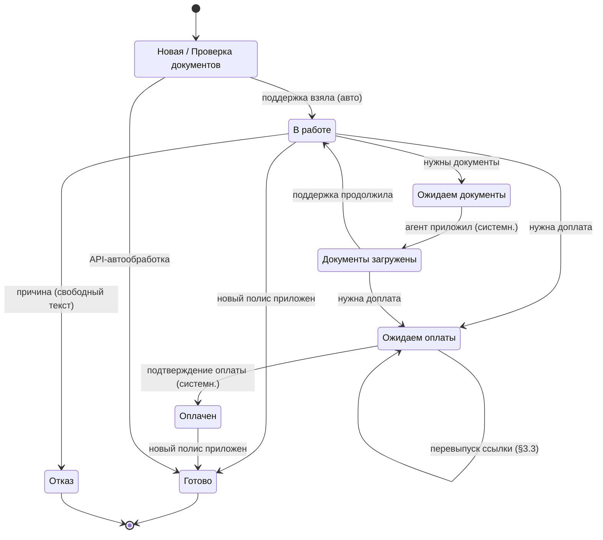
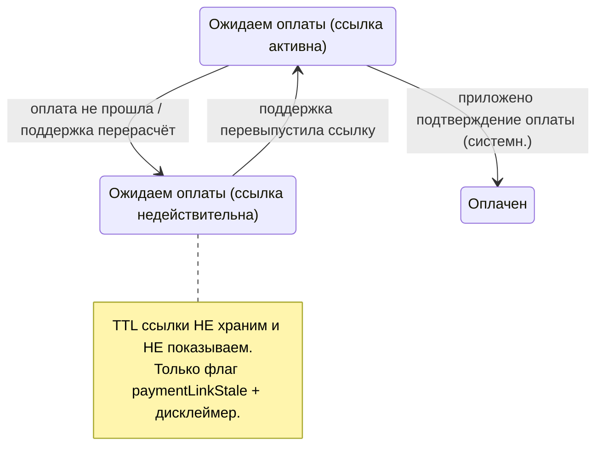
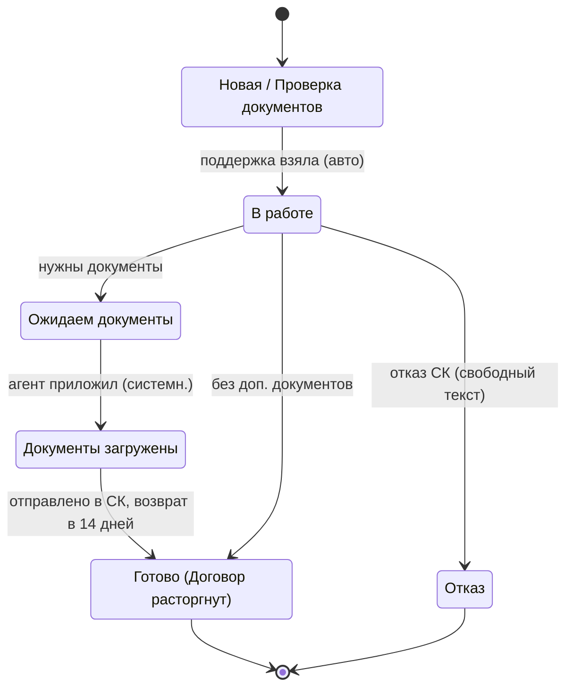
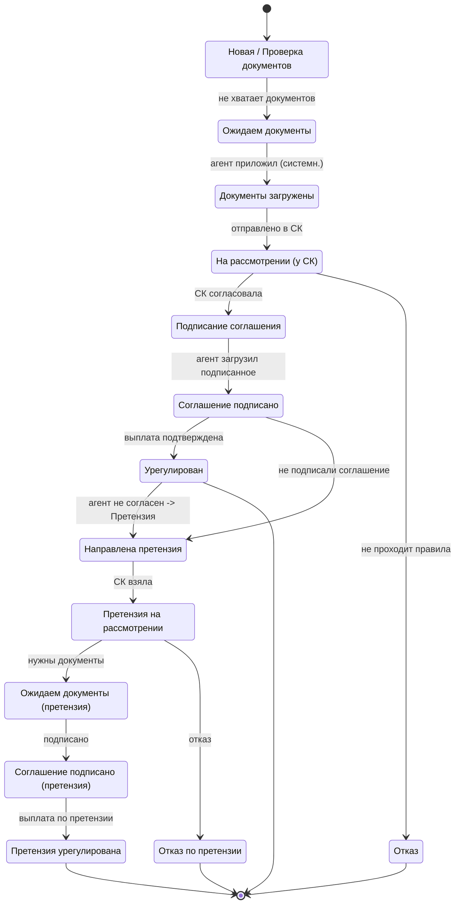
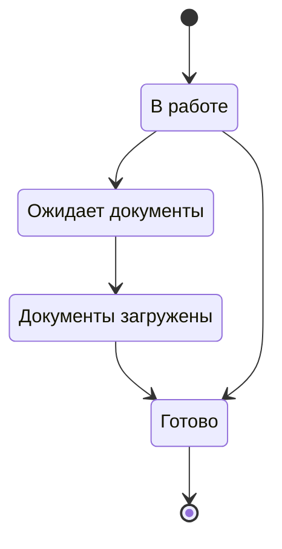
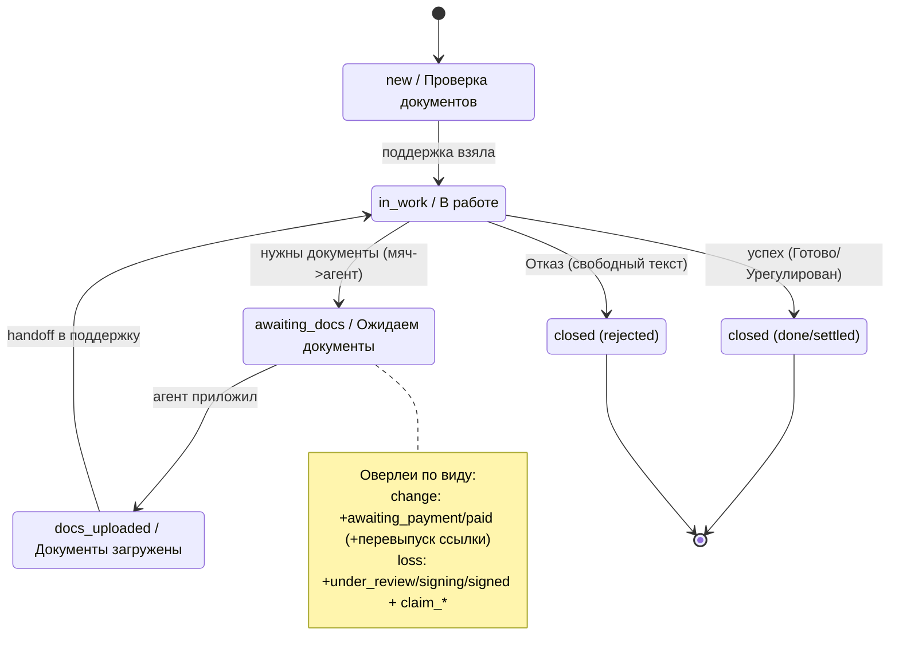

# 10a. Статусная модель процессов (по доске «ПРОЦЕССЫ-АА»)

> Дата: **2026-08-26**. Обновлено **2026-08-27** (решения владельца — см. §9). Автор: Белов (системный аналитик).
> Источник: **доска FigJam «ПРОЦЕССЫ-АА»** (полный дамп 2 340 строк) + сверка с репо:
> [`10-processes.md`](./10-processes.md), [`process.service.ts`](../../src/app/core/services/process.service.ts),
> [`deal.model.ts`](../../src/app/core/services/deal.model.ts), [`cancel.model.ts`](../../src/app/core/services/cancel.model.ts).
> Канон статусов ядра закодифицирован в [`api-contract.yaml`](../../api-contract.yaml) → схема `Case` (2026-08-27, additive).
> Контекст (Эванс): **ВИ + Расторжение** = Policy Administration (endorsement/cancellation);
> **Убыток** = Claims (FNOL→урегулирование→выплата→претензия); **Ошибка** = сервисный тикет; **Сделка** = pre-policy (в модели репо, НА ДОСКЕ ОТСУТСТВУЕТ).
>
> ⚠️ **Мок ≠ контракт.** Здесь описана статусная модель ИЗ ДОСКИ (то, «как хочет бизнес»), а не то, что сейчас в прототипе.
> Прототип (`process.service.ts`) сильно упрощён — см. §7 «Расхождения».

---

## 1. Перечень процессов на доске

Доска — это карта **бизнес-процессов заявок по договору** (1С-терминология «заявка» = наш «процесс»). Найдено **пять видов**, разложенных по дорожкам агент / поддержка / куратор / СК:

| # | Вид (дословный лейбл с доски) | Код | Bounded context | Статус на доске |
|---|-------------------------------|-----|-----------------|-----------------|
| 1 | **«Внесение изменений»** (ВИ) — «Бизнес процесс ВИ», подсценарии «ВИ ОСАГО», «ВИ по НС», «ВИ "Доктор в дорогу" + др кроссы», «ВИ по ЮЛ» | `change` | Policy Admin (endorsement) | Проработан детально (v1/v2/v3) |
| 2 | **«Расторжение полиса»** — «Расторжение полиса ОСАГО со стороны агента», «Кросс-продукты», «НС Ипотека 2 версия» | `cancel` | Policy Admin (cancellation) | Проработан (v1 + калькулятор возврата) |
| 3 | **«Урегулирование убытка»** (УУ) — «Убытки со стороны агента», «АГЕНТ ОСАГО / Жизнь / НС», ветка **«ПРЕТЕНЗИЯ»** | `loss` | Claims | Проработан детально (самый сложный, до 16 статусов) |
| 4 | **«ОШИБКА»** — отдельная секция, «Сообщить об ошибке» (правая кнопка), список типов ошибок | `error` | Сервисный тикет | Помечено **«пока не делаем»** |
| 5 | **«ЮЛ»** — отдельный **тип заявки** в фильтрах, оверлей над ВИ/УУ (подписанные с печатями документы от ЮЛ) | `legalEntity` (оверлей) | Policy Admin / Claims | Как отдельный тип фильтра + пакет документов |

**Ключевые лейблы дословно (цитаты с доски):**
- «Бизнес процесс ВИ», «ВИ со стороны агента», «ВИ со стороны поддержки», «ВИ по ЮЛ».
- «Расторжение полиса ОСАГО со стороны агента», «Статусы 2.0».
- «Урегулирование убытка», «Убытки со стороны агента», «Убытки со стороны поддержки», «ПРЕТЕНЗИЯ».
- «Для агента статусы» / «Для поддержки» (везде разведены — см. §2).
- «Тип убытка: Первичный / Вторичный / Претензия», «Признак убытка: ПВУ / Классика», «Тип осмотра: Осмотр агентом / АО-НЭ клиента / Выездной осмотр».

**Чего на доске НЕТ:**
- **Сделки / «Согласования»** (pre-policy, `deal.model.ts`) — это отдельная разработка (память `deal_approval_flow`), доска её не знает.
- **Пролонгации** как процесса-заявки (она отдельный флоу поиска в НСИС, не заявка поддержки).

**Два актора-нюанса с доски:**
- **Поддержка и куратор — параллельные дорожки** («Поддержка + кураторы», «Куратор Урегулирование убытка», «Куратор Расторжение полиса»). Куратор работает с той же заявкой.
- **СК (страховая) — внешний контур.** «На рассмотрении», «Претензия на рассмотрении» = мяч у СК; агенту видно только итог.

---

## 2. Главное открытие доски: ДВА словаря статусов (агент vs поддержка)

Доска **явно разводит** статусы, видимые агенту, и внутренние статусы поддержки. Это перевод между bounded contexts (Эванс), и его в прототипе нет.

| Внутренний (поддержка видит) | Внешний (агент видит) | Комментарий с доски |
|------------------------------|-----------------------|---------------------|
| **Новая** (без ответственного) | **Проверка документов** | «этот статус вернуть нельзя»; агенту слово «Новая» не показываем |
| **В работе** (назначен ответственный) | **В работе** | ✅ РЕШЕНО (2026-08-27): агенту **показываем** «В работе», строку не скрываем |
| **Ожидаем документы** | **Ожидаем документы** / «Ожидает вашего ответа — запрос документов» | «Статус ожидает ответа — не понятен агентам» (переименовать) |
| **Документы загружены** (системный) | Документы загружены | авто после загрузки агентом |
| **Ожидаем оплаты** (отправили ссылку) | Ожидаем оплаты | только ВИ; ссылка на доплату (срок жизни НЕ указываем — см. §3.3) |
| **Оплачен** (системный) | Оплачен | авто после подтверждения оплаты |
| **На рассмотрении** (у СК) | На рассмотрении | УУ; «Страховая компания взяла в работу» |
| **Подписание соглашения** | Подписание соглашения | УУ; «Подпишите у клиента и загрузите» |
| **Соглашение подписано** | Соглашение подписано | УУ |
| **Урегулирован** | Урегулирован | УУ, терминал-успех |
| **Готово** | Готово | ВИ/Р, терминал-успех |
| **Отказ** (+ поле «причина отказа» — **свободный ввод**) | Отказ | ✅ РЕШЕНО (2026-08-27): причина отказа = **свободный текст**, без справочника |

Плюс **событие-статус** «**Ответ агента» / «Агент ответил**» — на доске появляется отдельной строкой в истории («Я всё правильно сделал?»). Это **комментарий-событие**, а не состояние жизненного цикла (guard-нейтральное).

**Роли «чей мяч» (ballHolder), выведено из дорожек и действий:**

| Статус | Чей мяч | Почему |
|--------|---------|--------|
| Новая / В работе | **поддержка** | разбирает, назначает ответственного |
| Ожидаем документы | **агент** | «Загрузите: СТС, ВУ» — действие агента |
| Документы загружены | **поддержка** | системный handoff обратно |
| Ожидаем оплаты | **клиент/агент** | «Оплатите …» (клиент платит, агент подтверждает) |
| Оплачен | **поддержка** | продолжает оформление |
| На рассмотрении | **страховая (СК)** | «СК взяла в работу» |
| Подписание соглашения | **агент** | «Подпишите у клиента и загрузите» |
| Соглашение подписано | **поддержка/СК** | передаёт на выплату |
| Урегулирован / Готово / Отказ | **никто (терминал)** | — |

---

## 3. Процесс «Внесение изменений» (ВИ / `change`)

### 3.1 Статусы и переходы

| Переход | Событие / триггер | Условие (guard) | Чей мяч |
|---------|-------------------|-----------------|---------|
| — → **Новая** (агент: Проверка документов) | агент отправил заявку («Сохранить изменения») | форма + причина + документы (валидация **мягкая** — см. §3.4) | поддержка |
| Новая → **В работе** | поддержка взяла заявку / назначила ответственного | — (авто, «как поддержка взяла») | поддержка |
| В работе → **Ожидаем документы** | поддержке не хватает документов | нужен доп. документ (СТС/ВУ и т.п.) | агент |
| Ожидаем документы → **Документы загружены** | агент приложил документы | загрузка успешна (**системный**, авто) | поддержка |
| В работе / Документы загружены → **Ожидаем оплаты** | требуется доплата за изменение | новая премия > старой → ссылка на доплату | клиент/агент |
| Ожидаем оплаты → **Оплачен** | агент приложил подтверждение оплаты | оплата подтверждена (**системный**) | поддержка |
| В работе / Оплачен → **Готово** ✅ | поддержка внесла ВИ в B2B СК, приложила новый полис, сменила № полиса | новый полис получен | — (терминал-успех) |
| любой → **Отказ** ❌ | правила не позволяют | **причина = свободный текст** (напр. отказ по КБМ / вписание водителя < 3 мес) | — (терминал-отказ) |

**Автоматическая ветка (API Ренессанс):** «Проверка документов → Готово» (обработается автоматически, «Заявка API») **или** «Проверка документов → Ожидаем оплаты (Оплатите 2500 ₽)». Ручной путь — фолбэк, если автомат не сработал.

**ТЕРМИНАЛЬНЫЕ:** Готово (успех), Отказ (отказ). **МЯЧ У АГЕНТА:** Ожидаем документы, Ожидаем оплаты.

### 3.2 Mermaid

### 3.3 Подпроцесс «Перевыпуск ссылки на доплату» (мини-флоу) — РЕШЕНО (2026-08-27)

**Решение владельца:** срок жизни ссылки на доплату мы **НЕ знаем и НЕ указываем** (цена может измениться на следующий день, ссылка «в 00:00 не рабочая» — но точного TTL у нас нет). Поэтому:

- **(а) Дисклеймер.** Рядом со ссылкой/статусом «Ожидаем оплаты» показываем предупреждение: *«Ссылка на оплату может стать недействительной. Если оплата не проходит — запросите новую ссылку у поддержки»*. Не выдумываем таймер/обратный отсчёт (нельзя показывать факт, которого не знаем — принцип из `deal.model`).
- **(б) Перевыпуск.** В статусе `awaiting_payment` заложен подпроцесс повторной выдачи ссылки. Модель в контракте: флаг **`paymentLinkStale`** (ссылка помечена недействительной) + счётчик/версия выдачи. Ссылка не «протухает по таймеру» в нашей модели, а **инвалидируется явно** (агентом «не проходит» / поддержкой при перерасчёте).

**Мини-флоу перевыпуска (остаёмся в статусе `awaiting_payment`, self-loop):**

| Шаг | Кто | Действие | Что меняется |
|-----|-----|----------|--------------|
| 1 | агент/клиент | пытается оплатить — не проходит | — |
| 2 | агент | «Запросить новую ссылку» / комментарий поддержке | `ballHolder: support`, старую ссылку помечаем `paymentLinkStale=true` |
| 3 | поддержка | перевыставляет ссылку (возможно новая сумма) | новая `paymentLink`, `paymentLinkStale=false`, `ballHolder: client` |
| 4 | агент | видит обновлённую ссылку и дисклеймер | статус остаётся «Ожидаем оплаты» |
| 5 | агент | приложил подтверждение оплаты | → **Оплачен** (системный) |

### 3.4 Валидация «Далее» — мягкая (РЕШЕНО 2026-08-27)

**Решение владельца:** переход «Далее» **НЕ блокируем**, если приложены не все документы. Валидация — **мягкая (предупреждение), не стоп**: агент может идти дальше, поддержка запросит недостающее статусом «Ожидаем документы». Это снимает пункт «Блокировать далее шаг если не все документы» из вопросов.

---

## 4. Процесс «Расторжение полиса» (`cancel`)

### 4.1 Статусы и переходы

| Переход | Событие / триггер | Условие (guard) | Чей мяч |
|---------|-------------------|-----------------|---------|
| — → **Новая** (агент: Проверка документов) | агент подал расторжение (заявитель + причина + документы) | форма валидна; расчёт возврата показан («К выплате 1 231 ₽ до 24.02») | поддержка |
| Новая → **В работе** | поддержка взяла заявку | — (авто) | поддержка |
| В работе → **Ожидаем документы** | нужны документы (пакет зависит от причины) | причина требует доп. документ (ДКП, акт приёма-передачи и т.п.) | агент |
| Ожидаем документы → **Документы загружены** | агент приложил (**системный**) | — | поддержка |
| Документы загружены → **Готово** ✅ | поддержка отправила договор в СК на расторжение; выплата | «автоматически через 14 дней» (возврат до 14 к.д.) | — (терминал-успех) |
| любой → **Отказ** ❌ | СК/правила отказали | причина = **свободный текст** | — (терминал-отказ) |

**Особенность:** «Тип заявки в Р не нужен». **Возврат премии** считаем на своей стороне (калькулятор, см. [10-processes §2](./10-processes.md)), «сумма может быть скорректирована СК». Отдельная почта `cancellation@agentacademy.ru`.

**ТЕРМИНАЛЬНЫЕ:** Готово (успех, +14 дней на выплату), Отказ. **МЯЧ У АГЕНТА:** Ожидаем документы.

### 4.2 Mermaid

---

## 5. Процесс «Урегулирование убытка» (`loss`) — Claims

✅ РЕШЕНО (2026-08-27): модель убытка **принята как есть** (16 статусов поддержки + ветка претензии).

✅ УТОЧНЕНО ВЛАДЕЛЬЦЕМ (2026-09-21): **«Урегулирован» — только когда выплата подтверждена.** Передача на выплату не является завершением. Это уточнение заменяет прежний триггер «Отдали на выплату»; после подписания соглашения заявка остаётся открытой до подтверждения выплаты. В HTML-прототипе подтверждение фиксирует поддержка отдельным действием, с суммой и фактической датой выплаты.

Самый сложный: полный FNOL → урегулирование → выплата + **ветка досудебной претензии**. Поля убытка: № убытка, Дата заявления, **Тип убытка** (Первичный/Вторичный/Претензия), **Признак убытка** (ПВУ/Классика; РС/ГО), **Тип осмотра** (Осмотр агентом / АО-НЭ клиента / Выездной осмотр), Дата соглашения СК, Дата соглашения от агента, Дата оплаты, Сумма выплаты.

### 5.1 Основной поток + переходы

| Переход | Событие / триггер | Условие (guard) | Чей мяч |
|---------|-------------------|-----------------|---------|
| — → **Новая** (агент: Проверка документов) | агент заявил убыток (заявитель: Собственник / Представитель по доверенности) | пакет документов приложен (валидация мягкая) | поддержка |
| Новая → **Ожидаем документы** | не хватает документов | напр. «СТС не читаемо» | агент |
| Ожидаем документы → **Документы загружены** | агент приложил (**системный**) | — | поддержка |
| Документы загружены → **На рассмотрении** | поддержка завела и отправила в СК | «СК взяла в работу» | страховая (СК) |
| На рассмотрении → **Подписание соглашения** | СК согласовала; «Направляем документы» → «Подпишите у клиента и загрузите» | — (2 строки: направили + агент подписывает) | агент |
| Подписание соглашения → **Соглашение подписано** | агент загрузил подписанное соглашение | если не подписали — комментарий или **претензия** | поддержка/СК |
| Соглашение подписано → **Урегулирован** ✅ | поддержка подтвердила выплату | выплата подтверждена; указаны сумма и фактическая дата выплаты | — (терминал-успех) |
| любой → **Отказ** ❌ | «Убыток не подходит под правила урегулирования» | + поле «причина отказа» = **свободный текст** | — (терминал-отказ) |

### 5.2 Ветка претензии (оверлей, кнопка «Оставить претензию» / «Сформировать претензию»)

| Переход | Событие | Чей мяч |
|---------|---------|---------|
| Урегулирован / Соглашение подписано → **Направлена претензия** | агент не согласен, нажал «Претензия» | поддержка/СК |
| Направлена претензия → **Претензия на рассмотрении** | СК взяла претензию | страховая |
| → **Ожидаем документы по претензии** | нужны документы | агент |
| → **Документы загружены** → **Подписание соглашения по претензии** → **Соглашение подписано** | по аналогии с основным | агент/поддержка |
| → **Претензия урегулирована** ✅ | выплата по претензии | — (терминал) |
| → **Отказ по претензии** ❌ | отказ (свободный текст) | — (терминал) |

**Полный список статусов поддержки для УУ (дословно с доски, text 1489:2006):** 1. Новая · 2. На рассмотрении · 3. Ожидаем документы · 4. Документы загружены · 5. Подписание соглашения · 6. Соглашение подписано · 7. Урегулирован · 8. Отказ (поле причина отказа) · 9. Направлена претензия · 10. Претензия на рассмотрении · 11. Ожидаем документы по претензии · 12. Документы загружены · 13. Подписание соглашения по претензии · 14. Соглашение подписано · 15. Претензия урегулирована · 16. Отказ по претензии.

**ТЕРМИНАЛЬНЫЕ:** Урегулирован, Претензия урегулирована (успех); Отказ, Отказ по претензии (отказ). **МЯЧ У АГЕНТА:** Ожидаем документы, Подписание соглашения, Ожидаем документы по претензии.

### 5.3 Mermaid

---

## 6. Процесс «Ошибка» (`error`) — на доске есть, «пока не делаем»

Отдельная секция «ОШИБКА». Создаётся агентом/куратором («Сообщить об ошибке» — правая кнопка). **Типы ошибок** (дословно): Получение ПФ · Аннулирование ОСАГО · Ошибка при скачивании полиса · Отмена ДВС · Отмена ОСАГО · **Отмена двойного списания** · Ссылка на оплату · Отмена НС (и т.д.). Без ограничений на форматы файлов (фото/видео).

**Статусы (для агента и куратора):** В работе · Ожидает документы · Документы загружены · Готово. (Урезанная модель без «На рассмотрении»/оплаты.)

> ⚠️ «Отмена двойного списания» как тип ошибки — прямое подтверждение риска идемпотентности оплаты (Коберн/Хоп). Двойное списание УЖЕ случается и разруливается вручную тикетом. В V1 write-операции оплаты обязаны быть идемпотентными.

---

## 7. Нормализованное ядро — единый Case-автомат (Process + Deal → ядро)

Доска подразумевает **один автомат с оверлеями по видам** (у всех процессов общий костяк Новая→В работе→Ожидаем документы→…→терминал, а специфика — оверлей). Это ровно «ядро Белова» из `deal.model.ts`: UI смотрит на **`phase` + `ballHolder` + `actionRequired`**, а не на `switch(status)`. Закодифицировано в [`api-contract.yaml`](../../api-contract.yaml) → схема `Case` (additive, 2026-08-27).

### 7.1 Канонические статусы ядра (машинное имя → рус. лейбл)

| Канон (`status`) | Рус. лейбл (агент) | Рус. лейбл (поддержка) | `phase` | `ballHolder` | Терминал |
|------------------|--------------------|------------------------|---------|--------------|----------|
| `new` | Проверка документов | Новая | `intake` | support | — |
| `in_work` | В работе | В работе | `in_progress` | support | — |
| `awaiting_docs` | Ожидаем документы | Ожидаем документы | `action_required` | **agent** | — |
| `docs_uploaded` | Документы загружены | Документы загружены | `in_progress` | support | — |
| `awaiting_payment` | Ожидаем оплаты | Ожидаем оплаты | `action_required` | **client/agent** | — |
| `paid` | Оплачен | Оплачен | `in_progress` | support | — |
| `under_review` | На рассмотрении | На рассмотрении | `with_insurer` | insurer | — |
| `signing` | Подписание соглашения | Подписание соглашения | `action_required` | **agent** | — |
| `signed` | Соглашение подписано | Соглашение подписано | `in_progress` | support | — |
| `settled` | Урегулирован | Урегулирован | `closed` | none | ✅ успех |
| `done` | Готово | Готово | `closed` | none | ✅ успех |
| `rejected` | Отказ | Отказ *(+ свободная причина)* | `closed` | none | ❌ отказ |

**Оверлей претензии (только `loss`):** `claim_filed` · `claim_review` · `claim_awaiting_docs` · `claim_docs_uploaded` · `claim_signing` · `claim_signed` · `claim_settled` (✅) · `claim_rejected` (❌).

**Событийный оверлей (не lifecycle):** `agent_replied` («Ответ агента») — это комментарий-событие в истории, не состояние.

**Разведение словарей (P0-находка) в контракте:** каноничный `status` (машинный enum) + два лейбл-поля в `statusHistory` не дублируем; вместо этого лейблы агент/поддержка вычисляются из справочника по паре (`status`, роль). В схеме `Case` каноничный `status` — источник, `agentStatusLabel`/`supportStatusLabel` — вычисляемые вью-поля (см. `api-contract.yaml`).

### 7.2 Матрица: какой статус в каком виде

| Статус | ВИ `change` | Расторжение `cancel` | Убыток `loss` | Ошибка `error` |
|--------|:----------:|:-------:|:----:|:------:|
| new | ✅ | ✅ | ✅ | (in_work) |
| in_work | ✅ | ✅ | — | ✅ |
| awaiting_docs | ✅ | ✅ | ✅ | ✅ |
| docs_uploaded | ✅ | ✅ | ✅ | ✅ |
| awaiting_payment / paid | ✅ | — | — | — |
| under_review | — | — | ✅ | — |
| signing / signed | — | — | ✅ | — |
| settled | — | — | ✅ | — |
| done | ✅ | ✅ | — | ✅ |
| rejected | ✅ | ✅ | ✅ | — |
| claim_* (оверлей) | — | — | ✅ | — |

### 7.3 Mermaid ядра (общий костяк без оверлеев)

### 7.4 Как ложится `Deal` (сделка) в это ядро

`deal.model.ts` уже реализует ядро правильно (phase+ballHolder+actionRequired). Маппинг фаз на общий `phase`:

| Deal `phase` / `status` | Ядро `phase` | ballHolder |
|-------------------------|--------------|------------|
| `draft` | `intake` | agent |
| `submitted` / `with-insurer` | `in_progress` / `with_insurer` | support / insurer |
| `insurer-info` / `offer-review` (action-required) | `action_required` | agent |
| `payment` (`payment-link`) | `action_required` | client |
| `finalizing` (`contract-upload`) | `in_progress` | support |
| `closed` (`completed`/`declined`/`expired`/`withdrawn`) | `closed` | none |

Итог: **три модели репо (`PolicyProcess` 6-статусов, `Deal` 12-статусов, `cancel.model`) и модель доски (агент/поддержка + претензия) должны сойтись в ОДИН `Case`** с общим ядром и оверлеями по `kind`.

---

## 8. Сверка доска ↔ репозиторий (расхождения, пронумеровано)

> Легенда приоритета: **P0** — ломает доменную корректность/флоу; **P1** — мешает; **P2** — косметика.

1. **[P0] Число статусов. Прототип схлопнул 3 разные модели в одну плоскую из 6.**
   Доска (2.0): ВИ ~9, Расторжение ~7, Убыток **до 16** (с претензией). `process.service.ts` → единый enum `ProcessStatus = submitted | checking-docs | in-work | awaiting-docs | done | rejected` **на все три вида**. Специфика УУ и доплаты ВИ отсутствует. → закрыто контрактом `Case` (§7, `api-contract.yaml`).

2. **[P0] Нет разделения словарей «агент vs поддержка».**
   Доска явно: поддержка «Новая», агент «Проверка документов». (Вариант «В работе скрывать строкой» — ✅ ОТМЕНЁН владельцем 2026-08-27, показываем.) В прототипе один `PROCESS_STATUS_LABEL` для всех ролей. Контракт `Case` разводит `agentStatusLabel`/`supportStatusLabel`.

3. **[P0] «Ожидаем оплаты» / доплата за изменение (ВИ) отсутствует в модели процесса.**
   Доска: ВИ имеет ветку доплаты (ссылка → «Ожидаем оплаты» → «Оплачен») + подпроцесс перевыпуска ссылки (§3.3). В `ProcessStatus` статусов `awaiting_payment`/`paid` нет. Контракт `Case` вводит оверлей `payment` (сумма, ссылка, `paymentLinkStale`). Тянет **идемпотентность** (тип ошибки «Отмена двойного списания»).

4. **[P0] Ветка претензии (УУ) и все поля убытка отсутствуют.**
   Доска: 8 статусов претензии + поля № убытка, тип/признак убытка, тип осмотра, суммы/даты. `PolicyProcess` их не содержит. Контракт `Case` вводит оверлей `claim` + `CaseLossDetails`.

5. **[P1] Терминология итога расходится.**
   Прототип: `done → 'Изменения внесены'`; доска: ВИ/Р = «Готово», УУ = «Урегулирован» (не «Готово»); `rejected` = «Отказ» (не «Отклонено»). Свести к доске.

6. **[P1] `Deal`/«Согласование» — модель репо, которой НЕТ на доске; при этом только она содержит правильное ядро.**
   В репо две несведённые модели (`PolicyProcess` без ядра + `Deal` с ядром), доска даёт третью. `Case` собирает ядро из всех трёх (§7.4).

7. **[P1] Вид «Ошибка» на доске есть, в `ProcessKind` — нет.**
   `ProcessKind = change | cancel | loss`. Доска: «Ошибка» — отдельный тип, «пока не делаем», но тип-фильтр уже в очереди поддержки. В `Case.kind` заложен `error`.

8. **[P2] Расхождение порядка статусов УУ между «10-processes.md (1.0)» и доской (2.0).**
   1.0: «…→ На рассмотрении → Ожидаем документы …»; 2.0: «Ожидаем документы → Документы загружены → На рассмотрении …» (документы РАНЬШЕ отправки в СК). Взят вариант доски 2.0 как более свежий.

9. **[P2] Статус-событие «Ответ агента».** В прототипе это `ProcessComment` (правильно). При переносе истории не делать «Ответ агента» состоянием жизненного цикла.

10. **[P2] Фильтры/поля очереди поддержки шире, чем в модели.**
    Доска: тип-фильтр «ЮЛ», регион, СК, ответственный, «Не разобранные», чекбокс «заявки через API». `Case` несёт `object`, `insurerName`, `region`, `responsibleName`, `viaApi`, `legalEntity`.

---

## 9. Пробелы и вопросы владельцу

> Легенда: ✅ РЕШЕНО (с датой) — ответ владельца; ⏳ — открыто.

1. ✅ **РЕШЕНО (2026-08-27). Кто автор комментария при смене статуса?** — *(осталось уточнить)* пока фиксируем: автор = актор события (`actor` в `statusHistory`), авто-комментарии помечаются `actor: system`. ⏳ финальные тексты шаблонов — за бизнесом.
2. ✅ **РЕШЕНО (2026-08-27). «В работе» показывать агенту или скрывать?** → **ПОКАЗЫВАТЬ** агенту (строку не скрываем). Вариант «скрывать» убран из модели.
3. ✅ **РЕШЕНО (2026-08-27). Срок жизни ссылки на доплату (ВИ).** → срок **НЕ знаем и НЕ указываем**. Вместо этого: (а) дисклеймер «ссылка может стать недействительной»; (б) подпроцесс перевыпуска ссылки (§3.3), флаг `paymentLinkStale`. TTL/таймер не показываем.
4. ⏳ **«Ожидает ответа» непонятен агентам** — как переименовать внешний лейбл? (кандидат: «Ожидаем ваших действий»/«Нужны документы»). За бизнесом.
5. ✅ **РЕШЕНО (2026-08-27). Причина отказа — справочник или свободный ввод?** → **свободный текст** (`rejectReason`), без справочника.
6. ⏳ **Убыток: справочники «Тип убытка» / «Тип осмотра» / «Признак убытка».** «Крупный убыток не нужен — вносить **№ убытка**»; «Признак: ПВУ/Классика, РС и ГО — чекбокс». Нужен финальный справочник значений. (Модель убытка в целом ✅ принята как есть, 2026-08-27.)
7. ✅ **РЕШЕНО (2026-08-27). Блокировать «Далее» без всех документов?** → **НЕ блокировать**. Валидация мягкая (предупреждение), агент идёт дальше; недостающее поддержка запросит статусом «Ожидаем документы» (§3.4).
8. ⏳ **Цена в «Мои клиенты» после ВИ — старая или новая?** («Новая ЦЕНА при пролонгации учитывать»; сейчас показывается старая сумма). За бизнесом.
9. ⏳ **Валидация ВИ: какие данные можно менять, а какие нет** («не все данные можно изменить»). Нужны бизнес-правила по полям. За бизнесом.
10. ⏳ **API-заявки: какие статусы валидны** («отображаем? ДА, чекбокс с API»; «Не показываем по API — проанализировать статусы»). Сокращённый путь Проверка→Готово. За бизнесом/интеграцией (Родион).
11. ⏳ **Куратор vs поддержка:** какие статусы видит куратор, права (перенаправить заявку, взять списком). За бизнесом.
12. ⏳ **Хранение старых полисов после ВИ** — «Храним» (для аналитики убыточности). Нужен признак версии полиса (endorsement = новая версия, старую храним). За архитектурой.

---

## 10. Связанные документы

- [`10-processes.md`](./10-processes.md) — статусные модели «1.0» (источник `12_processes_1_0.txt`); этот файл — «2.0» с доски + ядро.
- [`12-gaps-vs-prototype.md`](./12-gaps-vs-prototype.md) — общая карта дельт прототип↔легаси.
- [`13-open-questions.md`](./13-open-questions.md) — реестр вопросов владельцу.
- [`api-contract.yaml`](../../api-contract.yaml) — схема `Case` (ядро статусов, оверлеи, пути `/cases`).
- `deal.model.ts` — эталон «ядра Белова» (phase+ballHolder+actionRequired), куда мигрируют change/cancel/loss.
- Память: `project_deal_approval_flow`, `project_process_visibility`, `project_attention_signal`.
